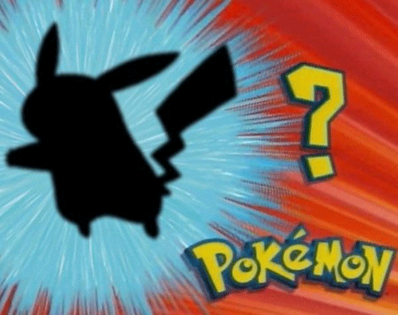
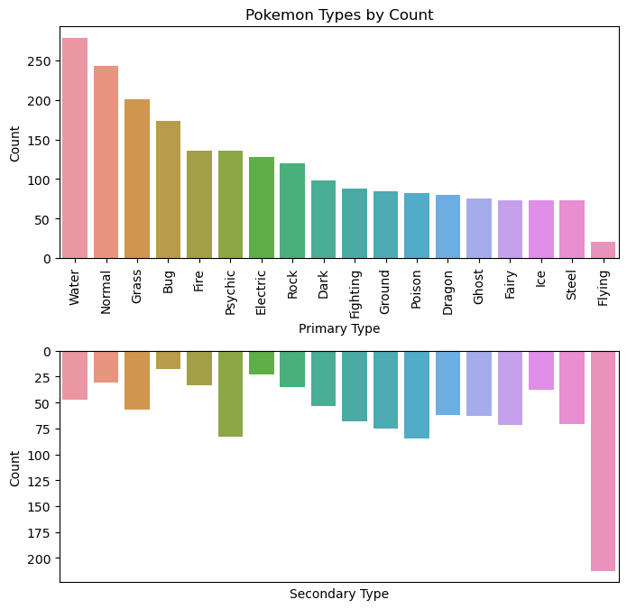
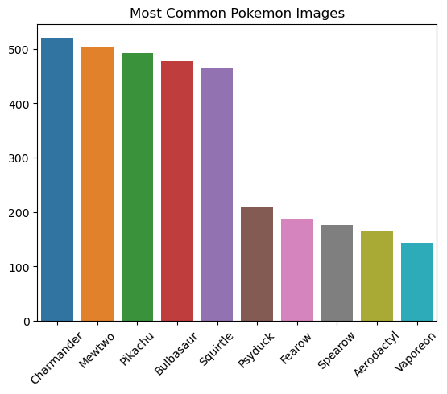
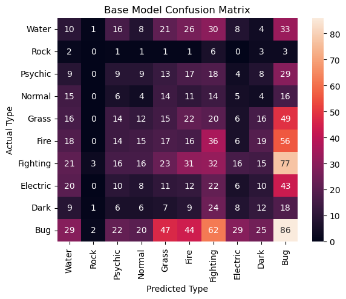

# Creating a Working Pokédex - Image Classification With Neural Networks

## Overview

Pokémon has been a staple of culture since the mid-90s, when the world was introduced to Pikachu and Ash through the anime and, following that, the hit Game Boy games Red and Blue version. Since then, the Pokémon company has added to its collection of pocket monsters with regular installments of the show and the game series. What started out as 150 monsters, has grown to over 1000 with more on the way.

In the game and anime, Pokémon trainers are guided through their journey to Pokémon Mastery by a device known as the Pokédex (this too is inhabited by a Pokémon named Rotom). The Pokédex is a technological innovation that can identify all Pokémon the trainer encounters, giving them useful insight into the nature of the monster.

I wanted to create a real-world Pokédex that could do the same – a neural network that could scan an image of a Pokémon and tell you its type, which could be anything from Water to Flying.

There are challenges off the bat that need to be considered: namely that it is difficult to determine a Pokémon's type just by looking at it. Many Grass type Pokémon, for example, have similar coloration to Bug types. Also many Bug types don't look like other Bug types. In addition, lots of Pokémon have primary and secondary types, making them even harder to classify.

Modeling with neural networks is tricky with more than a handful of classifiers. There are 18 types in total that a Pokémon can get their primary and secondary typing from. For the sake of the project, I've limited the amount of classifiers (and Pokémon included) to contain just the most common ones and only included the primary types as classifiers. This could mean the machine mislabels them for their primary type but could have labeled them correctly for their secondary type.

## The Data
 
The data comes from four sources: I scraped images and types from PokemonDB and Bulbapedia. I also used two Kaggle datasets – "7,000 Labeled Pokemon" by Lance Zhang and "Pokemon Generation One" by Harshit Dwivedi – which together contained nearly 18,000 images of the first 150 Pokémon. As a result, there are far fewer than the other 860.

In the end, after cleaning and cutting down to the main types, I had nearly 10,000 images to model on.

## Modeling

I began modeling with a simple convolutional neural network. Images were sized to 32 by 32 since Pokémon are largely simple in design – two or three colors and black outlines – and it made sense to all the machine to focus on a more generalizable image rather than get too up close with the images.

The first model was vastly overfit with a train accuracy of over 90% and a test accuracy of near 50%. To solve for this, each subsequent model was tuned with either more layers, regularization, or a change in optimizers. I first used the Adam optimizer and briefly tried SGD. Altering the learning rate with SGD kept breaking the kernel in a way I couldn't solve.

Ultimately, after five models, I was only able to raise the test accuracy to 55%. The previously discussed issues regarding image collection and typings could be the culprit, or it could be that the data heavily favored the first 150 Pokémon over the rest.

## Recommendations and Next Steps

My recommendations, then, are that the Pokémon company should consider matching their Pokémon designs more so to typing to help future gameplayers (mostly kids) learn about the world quickly and effectively. Also, the lack of images for the later generations had much to do with the lack of these Pokémon being present in marketing products and the show. This should be changed.

Next steps would be to collect more images and a greater diversity of them, paying special attention to the Pokémon that are underrepresented in the dataset. Also, bringing in all the types and secondary typing is critical to the next Pokédex.
